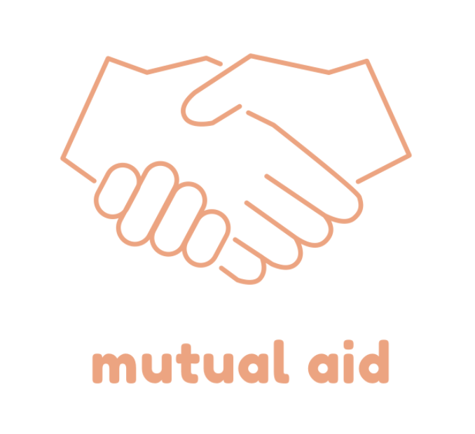

Mutual Aid Giving is a mobile-friendly web application, building off from one of Firebase's demo projects, for communities to create an open asking/giving platform. It's still in development for more features, including an in-app messaging system, map to display general location, tagging for posts, and more. This current version is minimally functional; users can login anonymously or with Google OAuth, create and respond to posts.

# How to use this project as a starting point
1. Create a project on https://firebase.google.com/
2. Follow the instructions to get started on a project.
3. Clone this project
4. 'firebase init' and select Database to create a database for the project 
5. Follow steps 3-4 in the next section to start developing locally

# How to get your project running locally as a contributor
1. Get in touch with the project owner for access to the project
2. Clone this repo
3. 'npm install' to get all the ingredients from the package.json recipe
4. Run the project locally with `firebase serve`
